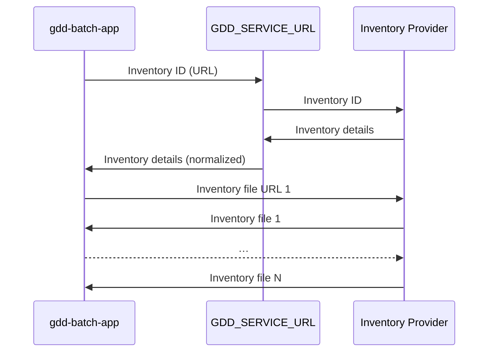

# gdd-batch-app

This command line application streamlines downloading (saving) inventories of files. It sends the unique inventory identifier (typically an URL) to the configured web service, retrieves individual file details and proceeds to download them. By default, it integrates with two platforms that provide data that is in the public domain.

You should have already received instructions on how to use this application (potentially including `GDD_SERVICE_URL` and how to set it) via a different channel.

## Overview

The configured web service (`GDD_SERVICE_URL`) is responsible for generating the list of URLs (and associated metadata) that this application can then use to download files.

